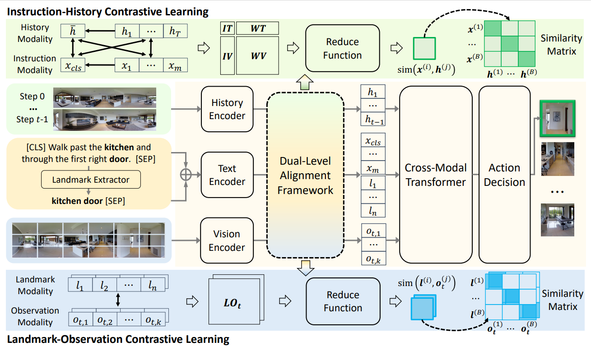

# DELAN
<div align="center">

<h1>🎇DELAN: Dual-Level Alignment for Vision-and-Language Navigation by Cross-Modal Contrastive Learning
</h1>


<br>

</div>


## 🍹 Abstract
Vision-and-Language navigation (VLN) requires an agent to navigate in unseen environment by following natural language instruction. For task completion, the agent needs to align and integrate various navigation modalities, including instruction, observation and navigation history. Existing works primarily concentrate on cross-modal attention at the fusion stage to achieve this objective. Nevertheless, modality features generated by disparate uni-encoders reside in their own spaces, leading to a decline in the quality of cross-modal fusion and decision. To address this problem, we propose a Dual-levEL AligNment (DELAN) framework by cross-modal contrastive learning. This framework is designed to align various navigation-related modalities before fusion, thereby enhancing cross-modal interaction and action decision-making. Specifically, we divide the pre-fusion alignment into dual levels: instruction-history level and landmark-observation level according to their semantic correlations. We also reconstruct a dual-level instruction for adaptation to the dual-level alignment. As the training signals for pre-fusion alignment are extremely limited, self-supervised contrastive learning strategies are employed to enforce the matching between different modalities. Our approach seamlessly integrates with the majority of existing models, resulting in improved navigation performance on various VLN benchmarks, including R2R, R4R, RxR and CVDN.

## 🍸 Method


## Requirements
1. Install Matterport3D simulators: follow instructions [here](https://github.com/peteanderson80/Matterport3DSimulator). 
```
export PYTHONPATH=Matterport3DSimulator/build:$PYTHONPATH
```

2. Install requirements:
```setup
conda create --name delan python=3.8 -y
conda activate delan
pip install -r requirements.txt
```

3. Download data from [Baidu Cloud](https://pan.baidu.com/s/1_dLTE1Y_VjEJMygR1ekTDA?pwd=7ip1), including processed annotations, connectivity, features and trained models of R2R, R4R, RxR and CVDN datasets. Put the data in `datasets' directory.

4. Download tokenizer files from [Baidu Cloud](https://pan.baidu.com/s/1QUtl7bmcZeU3IaR9eB4K4Q?pwd=7ip1), Put these in `tokenizer_files' directory.


## Training & Evaluation

Take the VLA agent DUET at R2R as example:

* To train the model, navigate to the map_nav_src and use the training part commands(https://github.com/mengfeidu/DELAN/blob/fbaf7bd7a75e9a0e06a70fb5b135de6836fc1aa2/map_nav_src/scripts/run_r2r_delan.sh#L70).
```
cd map_nav_src
cd map_nav_src
bash scripts/run_r2r_delan         # For R2R
# bash scripts/run_r4r_delan      # For R4R
# bash scripts/run_cvdn_delan     # For CVDN
```

* For inference, use the inference part commands(https://github.com/mengfeidu/DELAN/blob/ac8c9e7af7287a1928ebb1abd7216b20159d32e6/map_nav_src/scripts/run_r2r_delan.sh#L77-L82)
```
cd map_nav_src
bash scripts/run_r2r_delan # (run_r4r_delan, run_rxr_delan, run_cvdn_delan)
```

To run HAMT, follow the same procedure in the hamt_src directory.

## 🍻 TODOs

- [x] Upload pre-processed data.
- [x] Release DELAN code.

